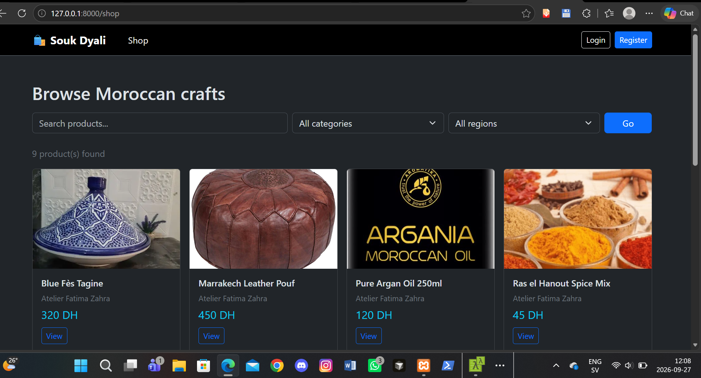
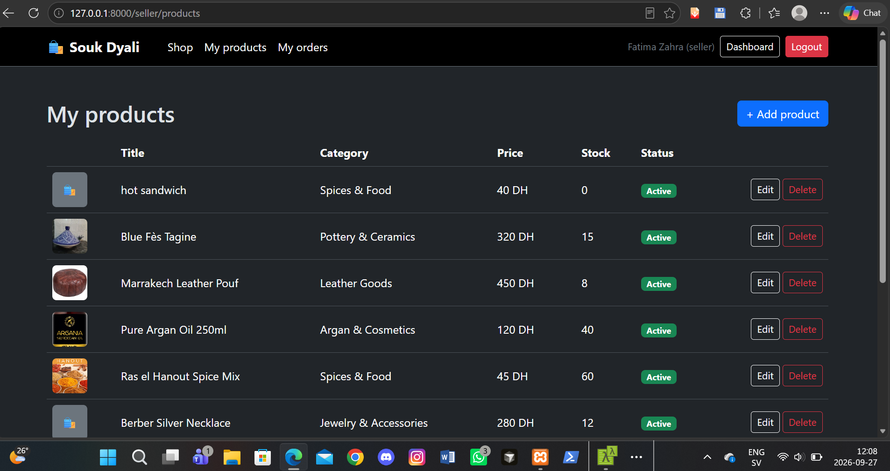
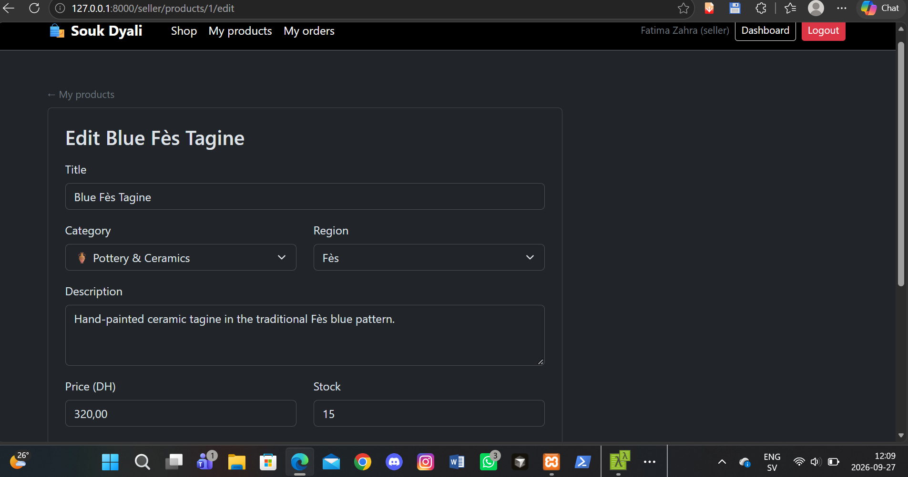
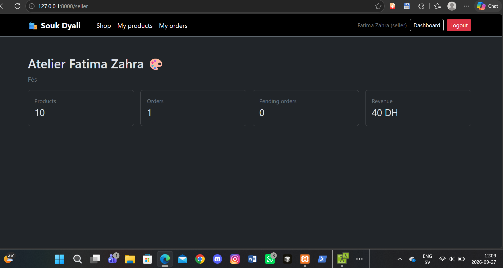
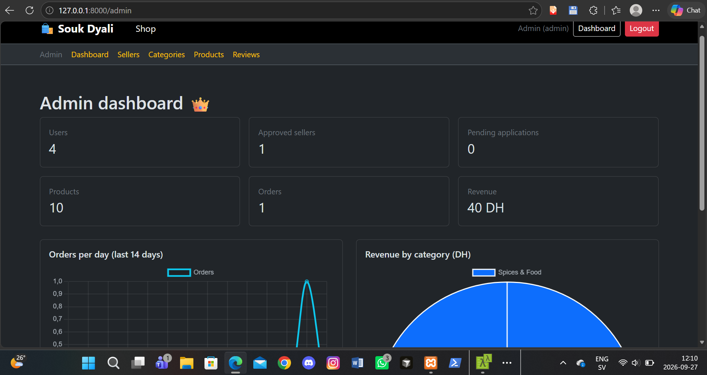
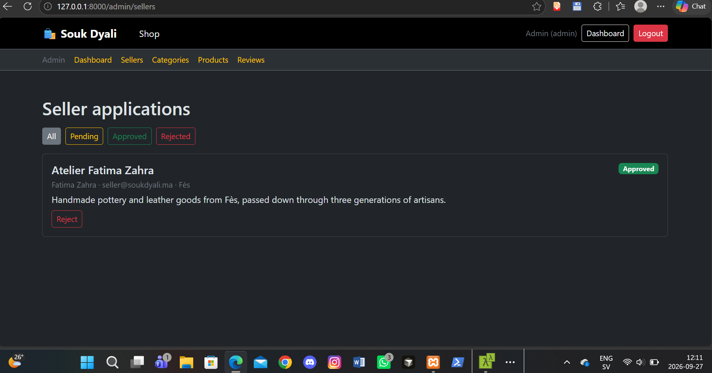

# 🛍️ Souk Dyali

An online marketplace connecting Moroccan artisans directly with buyers — pottery, leather goods, argan oil, jewelry, rugs, and more, sold straight from the workshop to your door.

Built as a complete multi-vendor e-commerce platform: three user roles (buyer, seller, admin), a seller application and approval workflow, a real shopping cart that splits into per-seller orders at checkout, stock-safe concurrent purchasing, order fulfillment tracking, reviews, and an admin back-office with statistics.

## 📸 Screenshots

**Shop — browse Moroccan crafts**


**Seller — manage products**


**Seller — edit a product**


**Seller dashboard**


**Admin dashboard — statistics**


**Admin — seller application approvals**


## ✨ Features

- 👤 **Three roles**: buyer, seller, admin — each with dedicated dashboards and permissions
- 📝 **Seller application workflow**: anyone can apply to become a seller; an admin reviews and approves or rejects the application before the shop goes live
- 🛒 **Real shopping cart**: buyers add products from multiple sellers to one cart
- 📦 **Per-seller order splitting**: checkout automatically creates one separate order per seller, since each artisan manages their own fulfillment independently
- 🔒 **Stock-safe checkout**: a database-level lock prevents two buyers from both purchasing the last unit of a product at the same instant
- 🚚 **Order fulfillment tracking**: sellers move orders through pending → confirmed → shipped → delivered
- ⭐ **Reviews tied to real purchases**: buyers can only review items from orders that were actually delivered to them
- 👑 **Admin back-office**: approve/reject sellers, manage categories, moderate products and reviews, view platform statistics
- 📊 **Statistics dashboard**: orders per day and revenue by category, powered by Chart.js
- 🖼️ **Product image uploads** with multiple photos per product
- 🛡️ **Security**: rate-limited login (brute-force protection), server-side role enforcement, price/title snapshots on orders (so a later product edit never rewrites order history)

## 🛠️ Tech stack

| Technology | Usage |
|---|---|
| Laravel 13 | Backend framework |
| PHP 8.3 | Language runtime |
| MySQL | Database |
| Blade | Server-rendered views |
| Bootstrap 5 | UI framework |
| Chart.js | Admin dashboard charts |
| Laravel Sanctum | API token support |

## 🚀 Installation

```bash
# Clone the project
git clone https://github.com/oussamabentaleb04/souk-dyali.git
cd souk-dyali

# Install dependencies
composer install

# Configure environment
cp .env.example .env
php artisan key:generate

# Set your database credentials in .env, then:
php artisan migrate --seed

# Run it
php artisan serve
```

Visit `http://127.0.0.1:8000`.

## 🔑 Test accounts

The seeder creates three demo accounts (password for all: `password`):

| Role | Email |
|---|---|
| Admin | admin@soukdyali.ma |
| Seller | seller@soukdyali.ma |
| Buyer | buyer@soukdyali.ma |

⚠️ These are local development credentials only — never use them on a public deployment.

## 📁 Project structure
app/
├── Http/Controllers/ # Auth, Catalog, Cart, Checkout, Orders, Seller*, Admin*...
├── Http/Middleware/ # RoleMiddleware (role-based access control)
├── Models/ # User, SellerProfile, Product, Order, OrderItem, Review...
database/
├── migrations/ # 14 tables: users, seller_profiles, products, orders...
└── seeders/ # Demo data (users, categories, regions, products)
resources/views/
├── admin/ # Seller approvals, categories, products, reviews
├── seller/ # Product management, order fulfillment
├── catalog/ # Public shop, product detail, seller shop pages
├── cart/, checkout/, orders/ # Buyer purchase flow
routes/web.php # All application routes

## 👨‍💻 Author

**Oussama Bentaleb**

🐙 [GitHub](https://github.com/oussamabentaleb04)

## 📄 License

This is a personal portfolio project, built for learning purposes.